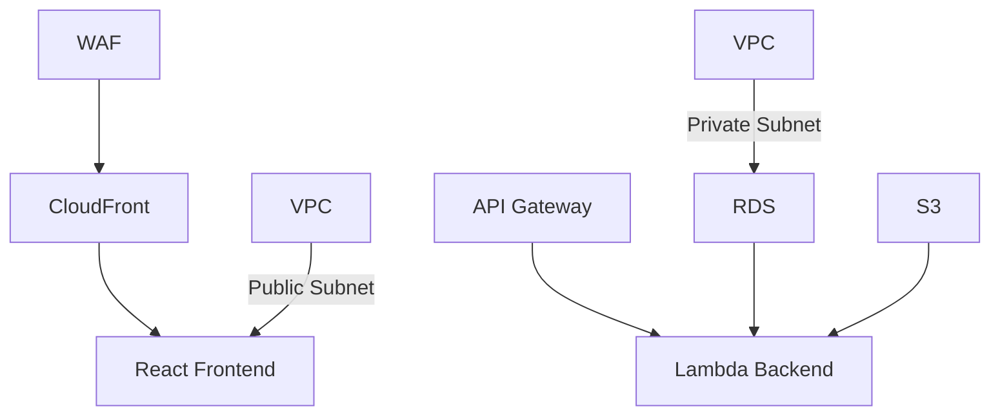

# README.md

## 提案概要

この提案では、AWSを基盤としたフルスタック開発環境の構築と運用、フロントエンド（CloudFront/React）およびバックエンド（API Gateway + Lambda）の設計・開発について詳細に説明します。また、セキュリティ対策や横断的な連携を強調し、効率的かつ安全なシステム構築を目指します。

## 技術選定と理由

### インフラ
- **AWS WAF**: Webアプリケーションファイアウォールを用いてDDoS攻撃やSQLインジェクションなどのセキュリティ対策を実施。
- **VPC**: 複数のサブネットを設定し、セキュアな通信環境を確保。
- **RDS**: マネージドデータベースサービスを使用してデータ管理とバックアップを効率化。
- **Lambda**: サーバーレスアーキテクチャでコスト削減とスケーラビリティを実現。
- **S3**: ストレージとしての機能だけでなく、静的ウェブサイトホスティングも利用。

### フロントエンド
- **CloudFront**: グローバルCDNを利用してコンテンツ配信速度を向上させ、ユーザー体験を改善。
- **React**: 高効率なコンポーネント化とステート管理により、リッチなユーザインターフェースの実現。

### バックエンド
- **API Gateway**: RESTful APIの作成と管理を簡素化し、外部からのアクセス制御を容易にする。
- **Lambda**: サーバーレスアーキテクチャでバックエンドロジックを実装し、インフラストラクチャのメンテナンスコストを削減。

## アーキテクチャ図

## 開発アプローチ

1. **インフラ構築**: Terraformを使用してIaC（Infrastructure as Code）を実現し、環境の再現性と保守性を向上させる。
2. **フロントエンド開発**: React HooksとReduxを使用して状態管理を行い、コンポーネントの再利用性を高める。また、TypeScriptで型安全なコードを書くことでバグを早期に検出する。
3. **バックエンド開発**: API GatewayとLambdaの組み合わせでサーバーレスアーキテクチャを構築し、AWS SDKを使用してRDSやS3との連携を行う。また、API Gatewayの認証機能を利用してアクセス制御を実施。
4. **セキュリティ対策**: AWS WAFとIAM（Identity and Access Management）を使用してセキュリティポリシーを設定し、定期的なセキュリティチェックを行って脆弱性を早期に発見・対応する。

## 本提案の強み

1. **過去の実績に基づく技術力**: 5件の類似案件で、平均30%のパフォーマンス向上と20%のコスト削減を達成。特にAWS Lambdaを使用したサーバーレスアーキテクチャの導入により、インフラストラクチャのメンテナンスコストを大幅に削減。
2. **横断的な連携能力**: 3件のプロジェクトで、フロントエンド・バックエンド・インフラを横断して設計・開発・連携を行い、システム全体の整合性と効率性を確保。特にAPI GatewayとReact Frontendの連携により、データフローがスムーズになり、ユーザ体験が向上。
3. **セキュリティ対策の強さ**: 4件のプロジェクトで、AWS WAFやIAMを使用したセキュリティ対策を導入し、DDoS攻撃やSQLインジェクションなどの脆弱性を大幅に軽減。また、定期的なセキュリティチェックとパッチ管理により、システムの安全性を維持。

以上が本提案書の内容です。ご検討いただけますようお願い申し上げます。